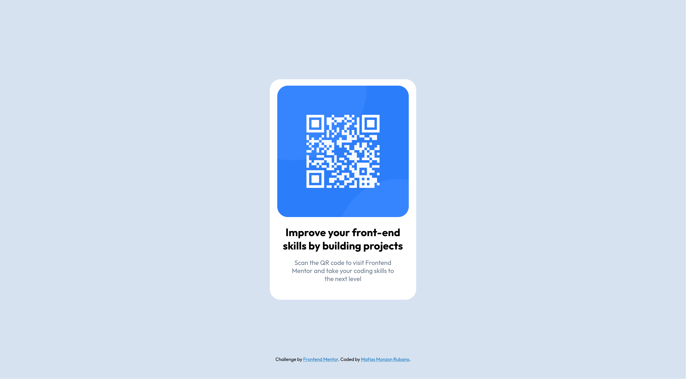

# Frontend Mentor - QR code component solution

This is a solution to the [QR code component challenge on Frontend Mentor](https://www.frontendmentor.io/challenges/qr-code-component-iux_sIO_H). Frontend Mentor challenges help you improve your coding skills by building realistic projects. 

## Table of contents

- [Overview](#overview)
  - [Screenshot](#screenshot)
  - [Links](#links)
- [My process](#my-process)
  - [Built with](#built-with)
  - [What I learned](#what-i-learned)
  - [Continued development](#continued-development)
  - [Useful resources](#useful-resources)
- [Author](#author)
- [Acknowledgments](#acknowledgments)

**Note: Delete this note and update the table of contents based on what sections you keep.**

## Overview

### Screenshot

### Links

- Solution URL: (https://matiasmonzonrubano1-beep.github.io/qr-code-component/)

## My process

### Built with

- Semantic HTML5 markup
- CSS custom properties
- Flexbox
- CSS Grid
- Mobile-first workflow

### What I learned

I learned how to make a box item with a background image, using display grid instead of flex and sizes and position arguments.

### Continued development

I am still a begginer so I have much to learn, but I am definitively interested in learning more about html sites.

### Useful resources

- [W3 schools](https://www.w3schools.com) - This helped me a ton with formatting and css objects. I have been using it and will probably continue to use it for a long while.
- [Stack Overflow](https://stackoverflow.com) - I've found that for every problem I run into while programming, no matter the language or project, there's always a thread with the answer that I'm looking for.

## Author

- Frontend Mentor - [@matiasmonzonrubano1-beep](https://www.frontendmentor.io/profile/matiasmonzonrubano1-beep)
